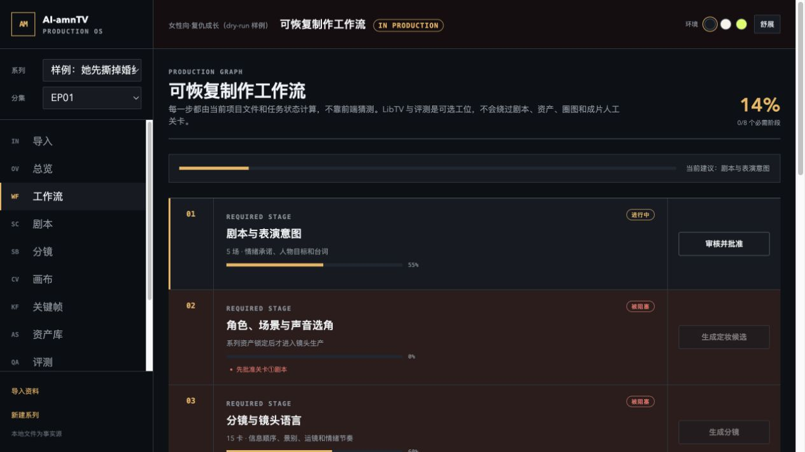

# AI-amnTV

> 把 AI 漫剧从“生成几个片段”，变成一条可审核、可恢复、可交付的本地制片流程。

[](https://github.com/Janettbella69/AI-amnTV/actions/workflows/ci.yml)
[](package.json)
[](LICENSE)
[](docs/architecture.md)

AI-amnTV 是面向 **9:16 AI 漫剧 / 动画短剧** 的本地优先 Production OS。它把小说或大纲、剧本、
角色定妆、分镜、配音、关键帧、图生视频、作监、评测、合成和交付组织成一条有人工关卡的生产线。

它不是另一个“输入提示词 → 等待视频”的生成器。AI-amnTV 负责的是更难也更容易被忽略的部分：
人物和声音能否跨镜保持一致、付费任务是否会重复提交、修改一张图后哪些结果需要失效，以及最终
能否交付 MP4、字幕、封面和 QC 证据。



## 为什么做 AI-amnTV

单次生成工具擅长产出素材，但一集可发布的漫剧还需要制片系统：

| 生产问题 | AI-amnTV 的处理方式 |
|---|---|
| 人物、服装、场景和音色不断漂移 | 系列级资产先锁定，镜头只引用资产 ID |
| 剧本、台词、分镜和素材互相脱节 | 结构化场景、台词 ID、卡号与逐卡状态 |
| 修改一个镜头却被迫重跑整集 | 单卡 retake round，旧候选和旧 take 永不覆盖 |
| 云任务中断后可能重复扣费 | 先落任务账本，再提交；不确定状态标记为 `orphaned` |
| “自动评分”掩盖真实审美问题 | 自动结构证据与人工看片 / 试听评分分离 |
| 生成完成却无法正式交付 | 统一合成 MP4、SRT、封面、AIGC 标识、QC 和稳定时间线 |

## 核心能力

### 一条能实际推进的制作工作流

- 10 个可见阶段：8 个必需阶段，以及 LibTV 画布、质量评测 2 个可选工位
- 四类人工关卡：剧本、定妆、分镜与关键帧、最终成片
- 工作流状态由项目文件、镜头状态和任务账本实时计算
- 每个阶段显示进度、阻塞原因和下一步动作
- 修改已批准内容时，只撤销受影响的下游结果

### 角色、声音和镜头连续性

- 角色、服装、场景、色板和音色按系列锁定，可跨集复用
- 音频先行，实际 TTS 时长回填到分镜
- 结构化提示词与最多 8 张显式参考图
- 支持首帧、首尾帧与本地 still-pan 降级
- 每张关键卡保留候选图、多个视频 take、生成元数据和 retake ticket

### 可恢复的生成与成本控制

- Fastify 本地 API、SQLite 持久任务队列和 SSE 实时进度
- 付费视频前执行 readiness gate
- 瞬时故障有限重试；未知远端状态不自动重提
- 已知成本与未知成本分开记录，不用估算值冒充供应商账单
- `AMNTV_DRY_RUN=1` 时不读取云密钥、不调用云服务

### 有证据的质量评测

- 三个检查点：剧本 / 分镜、样片 / 作监、成片 / 交付
- 覆盖剧本、人物、镜头语言、画面、配音、连续性、平台和交付
- 自动证据区分 `direct`、`proxy`、`missing`
- 人工评分必须记录具体画面、台词或声音证据
- 报告保存输入哈希；上游变化后自动显示为过期
- LibTV 和本地管线产物可以使用同一量表进行对比

### 受控的 LibTV 外部画布

- 用户明确选择本次发送的素材，不会上传整个项目
- 会话、远端 ID、续写轮次、消息和回收结果均持久化
- 不自动轮询，也不自动重复可能计费的请求
- 回收图片可晋升到指定镜头的首帧 / 尾帧候选
- 本地剧本、资产、审核关卡和交付仍是唯一事实源

## 3 分钟开始

### 环境要求

- Node.js 22.12+
- FFmpeg 与 FFprobe
- macOS 或 Linux（Windows 原生环境尚未验证）

```bash
git clone https://github.com/Janettbella69/AI-amnTV.git
cd AI-amnTV
npm ci
npm run build
```

### 只体验 Studio

创建一个不调用云服务的示例项目：

```bash
AMNTV_DRY_RUN=1 npm run dev -- demo demo-series
AMNTV_DRY_RUN=1 npm run dev -- studio
```

浏览器会打开 `http://127.0.0.1:4317`。进入“工作流”可以查看 15 卡示例分集、关卡依赖和下一步动作。

### 验证完整出片链路

```bash
AMNTV_DRY_RUN=1 AMNTV_NO_OPEN=1 npm run dev -- demo-run verification-series
```

这个命令会实际生成一条可播放的 60 秒、1080×1920、24fps 本地验收视频，并验证：

```text
projects/verification-series/episodes/EP01/final/
├── EP01.mp4
├── EP01.srt
├── cover.jpg
├── qc-report.yaml
└── jianying-draft/
```

dry-run 使用占位画面和提示音验证状态机、媒体处理和交付链路，**不代表云模型最终画面质量**。

## Studio 里有什么

| 页面 | 用途 |
|---|---|
| 导入 | 预检并导入完整项目、YAML / JSON 剧本、TXT / Markdown 小说或大纲 |
| 总览 | 查看项目规格、关卡、Provider 状态、成本与镜头进度 |
| 工作流 | 查看 10 阶段依赖、阻塞原因和下一步动作 |
| 剧本 | 编辑结构化场景、台词与情绪契约 |
| 分镜 | 编辑逐卡景别、运镜、人物、台词覆盖和生成模式 |
| 画布 | 使用受控 LibTV 会话创作、续写、回收和晋升结果 |
| 关键帧 | 对候选图进行圈选，检查首帧 / 尾帧与逐卡视频状态 |
| 资产库 | 管理并锁定角色、服装、场景和音色 |
| 评测 | 生成多维报告，并对图片 / 视频候选做同量表比较 |
| 任务 / 成本 | 查看持久任务、失败恢复、已知与未知费用 |
| 交付 | 预览并下载成片、字幕、封面和 QC 报告 |

Studio 默认只监听 `127.0.0.1`。YAML 和媒体文件是业务事实源；SQLite 只保存可恢复的后台任务。

## 从已有内容开始

“导入”页采用 **只读预检 → 确认写入** 两阶段流程：

1. **完整 AI-amnTV 项目**：导入包含 `series.yaml` 的项目目录，保留分集、媒体和历史状态。
2. **结构化剧本**：导入 YAML / JSON；可包含剧本、分镜、角色和场景。
3. **小说或大纲**：导入 TXT / Markdown 或粘贴正文，确认后再提交编剧 Agent。

导入不会覆盖同名系列；完整项目先复制到隐藏暂存目录，通过校验后再原子更名。符号链接、隐藏文件、
`.env` 和 `.studio` 不会被带入新项目。

## 生产流程


确定性编排、校验、状态迁移和文件写入由 TypeScript 完成。Claude Agent SDK 只用于需要创作或判断
的节点，不负责绕过关卡直接改生产状态。

## Provider 与外部能力

| 能力 | 当前实现 | 无密钥时 |
|---|---|---|
| 创作 Agent | Claude Agent SDK | 仅相关任务不可用 |
| 图片 | ComfyUI 工作流适配器 | dry-run 占位图 |
| TTS | MiniMax TTS | dry-run 可听提示音 |
| 图生视频 | MiniMax 视频适配器 | 本地 still-pan |
| 外部画布 | LibTV OpenAPI 会话 | 完整本地会话验收 |

复制配置模板并检查环境：

```bash
cp .env.example .env
npm run dev -- doctor
```

真实 Provider 的配置、安全边界和接入方法见
[Provider 接入指南](docs/provider-guide.md)。

## CLI 常用命令

```bash
# 项目
npm run dev -- init my-series --title "她先撕掉婚约" --genre "女性向复仇" --logline "退婚宴上，她用假账夺回主动权"
npm run dev -- script my-series EP01 outline.txt

# 生产
npm run dev -- cast my-series EP01
npm run dev -- storyboard my-series EP01
npm run dev -- audio my-series EP01
npm run dev -- keyframes my-series EP01
npm run dev -- generate my-series EP01
npm run dev -- compose my-series EP01

# 审核与运维
npm run dev -- review final my-series EP01
npm run dev -- status my-series EP01
npm run dev -- cost my-series EP01
npm run dev -- recover my-series EP01
```

不满意单个镜头时无需重跑整集：

```bash
npm run dev -- revise keyframe my-series EP01 EP01_S01_C001 --prompt "女主视线更坚定"
npm run dev -- revise video my-series EP01 EP01_S01_C001 --prompt "动作减慢，镜头保持稳定"
```

每次局部调整都会建立新 round，保留旧候选和旧 take，并只撤销该镜头的下游状态。

## 架构原则

技术栈：React 19 + Vite、Fastify、TypeScript、SQLite、Zod、Sharp / FFmpeg 与 Claude Agent SDK。

- **Local-first**：项目文件是唯一事实源，便于检查、备份和版本控制。
- **Human-gated**：Agent 负责创作，状态机与人工关卡负责放行。
- **Cost-aware**：付费操作先记账、再提交；不确定状态不自动重放。
- **Replaceable providers**：模型能力隐藏在 Provider 接口后，不把工作流绑定到单一供应商。
- **Precise invalidation**：修改场景或镜头时，只使真正受影响的下游产物失效。

详细数据结构、状态机和 API 分层见 [架构与数据约束](docs/architecture.md)。

## 测试与验收

```bash
npm run typecheck
npm test
npm run build
npm run verify

# 或一次运行全部检查
npm run check
```

CI 会在 Node.js 22 环境安装 FFmpeg 与中文字体，并执行完整的类型检查、测试、前端构建和 dry-run
成片验证。

## 当前边界

- 当前定位是单机、本地优先的生产工具，不是多用户 SaaS。
- 真实云调用可能产生费用；首次启用前请使用隔离账号和小额测试项目。
- LibTV 已完成安全适配、mock 和 dry-run 验收，但没有在无账号密钥环境中冒充实时接口已验证。
- MiniMax 视频需要把本地参考帧映射为供应商可读取的 HTTPS URL。
- `jianying-draft` 是实验性导出；`timeline.json` 才是稳定重建依据。
- 请只改编自有版权、已获授权或公版内容；不要使用未授权真人肖像或声音。

## 文档

| 文档 | 内容 |
|---|---|
| [架构与数据约束](docs/architecture.md) | 文件事实源、状态机、任务恢复与交付 |
| [多维评测系统](docs/evaluation-system.md) | 检查点、证据覆盖、人工评分与产物对比 |
| [视听表演质量规范](docs/production-quality.md) | 剧本、人物、配音、分镜和镜头语言目标 |
| [LibTV 对标说明](docs/libtv-benchmark.md) | 已实现能力、安全差异与剩余边界 |
| [Provider 接入指南](docs/provider-guide.md) | ComfyUI、MiniMax、LibTV 与扩展接口 |
| [竞品参考边界](docs/competitive-notes.md) | 即梦、可灵、LibTV 和案例研究的可借鉴部分 |
| [拍板记录](docs/decisions.md) | 产品定位和关键设计决策 |

## 贡献

欢迎提交 Issue 或 Pull Request。涉及工作流或 Provider 的修改，请同时补充测试，并确保：

```bash
npm run check
```

能够完整通过。请勿提交 API 密钥、生成项目、模型文件或未经授权的素材。

## License

[MIT](LICENSE) © 2026 Janettbella69
