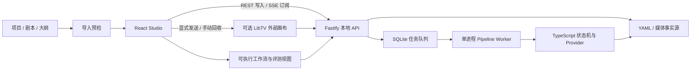

# 架构与数据约束

## 原则

1. 文件系统是唯一事实源；HTML 审核页和报告都是可重建视图。
2. TypeScript 状态机负责顺序、幂等、校验和付费门禁；Agent 不直接改状态。
3. 角色、场景、服装和音色先锁定，镜头只引用资产 ID。
4. 剧本锁定后，既有场号与台词 ID 只能保留；删场用 `omitted`，插入用字母后缀。
5. 分镜批准后，既有卡号不可删除或重排。
6. 云视频先记任务再提交；进程中断后标记 `orphaned`，不自动重提。
7. Studio 的 SQLite 只保存任务调度状态；业务文档、关卡、成本和交付仍以项目文件为准。

## Studio 分层



- Web 界面由 Vite 构建到 `dist-web/`，生产模式与 API 同源，避免额外跨域配置。
- API 默认只绑定 `127.0.0.1:4317`，并从 `/media/` 提供项目媒体预览。
- 队列串行 claim 任务，同一分集/阶段的排队或运行任务会去重。
- SSE 只传递任务和工作区失效通知；刷新后可从 SQLite 与项目文件完整恢复。

## 导入边界

导入采用“预检 → 提交”两阶段协议：

- `POST /api/imports/preview` 只解析与统计，不写入文件。
- `POST /api/imports` 会再次执行同一套预检，避免预检与提交之间发生同名冲突。
- 任何导入都只允许创建新系列；同名目标会阻塞，不做合并或覆盖。
- 完整项目先写入 `projects/.import-*/<series>`，全部完成后再原子更名到正式目录。
- 完整项目不跟随符号链接，不复制任何隐藏文件或目录；最多 100,000 个文件、50GB。
- YAML/JSON 与 TXT/Markdown 请求体最多 1.5MB；Studio 本身仍只监听本机回环地址。
- 小说或大纲仅落盘为来源草稿，不会在导入时自动排队或触发任何付费 Agent/Provider。

## 目录

```text
projects/<series>/
├── series.yaml
├── assets/
│   ├── characters/<CH-ID>/
│   │   ├── profile.yaml
│   │   ├── turnaround/main.png
│   │   └── candidates/
│   └── locations/<LOC-ID>/
├── episodes/<EP-ID>/
│   ├── script.yaml
│   ├── source.md
│   ├── source-meta.yaml
│   ├── storyboard.yaml
│   ├── state.yaml
│   ├── external/libtv/
│   │   └── sessions/
│   │       ├── <SESSION-ID>.yaml
│   │       └── <SESSION-ID>/results/
│   ├── evaluations/
│   │   ├── <EVALUATION-ID>.yaml
│   │   └── benchmarks/<BENCHMARK-ID>.yaml
│   ├── review/
│   ├── cuts/<CUT-ID>/
│   │   ├── audio/
│   │   ├── keyframes/candidates/<role>/round-<NN>/
│   │   ├── keyframes/selected/
│   │   ├── clips/
│   │   ├── tickets/
│   │   └── meta/
│   └── final/
```

生成元数据保存 provider、model、seed、prompt hash、参考图、输出路径和已知成本。候选 take 带
round，不会因局部重做被覆盖。

LibTV 会话同样属于项目文件事实源。远端会话 ID、增量消息序号、结果来源和本地回收文件均持久化；
SQLite 队列不接管它，避免 Studio 重启后把一次无法确认的外部提交自动执行第二次。

## 可执行工作流

`GET /api/series/:series/episodes/:episode/workflow` 不保存一份容易过期的“流程状态”，而是从关卡、
镜头 stage、后台任务、LibTV 会话和评测报告实时投影 10 个阶段。每个阶段给出
`complete/active/ready/blocked/optional`、进度、阻塞原因和下一动作。LibTV 与评测是可选支路，
不会绕过或阻塞剧本、定妆、分镜、配音、圈图、视频、合成和成片批准主链。

## 评测证据

评测报告和供应商对比报告都是不可变 YAML。每份内容评测记录当前项目 `inputHash`；剧本、分镜、
资产、关卡、镜头或交付状态变化后，读取接口会把旧报告标记为 `stale`，而不改写历史文件。自动
检查只使用结构和媒体事实；审美、表演、镜头意图与声音质感由人工证据输入。详细量表和判定规则见
[评测系统](evaluation-system.md)。

## 卡状态

```text
pending
  → audio_ready
  → keyframes_ready
  → keyframe_selected
  → video_generating
  → video_ready
  → sakkan_pass
  → composited
```

失败进入 `failed`。局部关键帧重做回到 `audio_ready`；只重做视频回到
`keyframe_selected`。这两种操作都会清除旧成片批准和交付记录。

锁定剧本内容被修改时，相关场景的卡回到 `pending`，剧本、分镜、圈图与成片关卡撤销；其他场景
的卡保持原状态。批准分镜被修改时，只有变化卡回到 `pending`，分镜状态回到 `draft`，剧本与定妆
关卡保留。音频文件元数据回填不被视为剧本内容修改，内部时长回填也不会误撤销分镜批准。

## 视频付费门禁

每卡提交视频前同时验证：

- 剧本已锁定
- 本集引用资产已锁定
- 分镜已批准
- 关键帧已圈选
- 音频时长已回填
- prompt 非空且不超过供应商上限
- 参考帧数量符合模式
- provider 已就绪并支持模式
- 没有同卡进行中的视频任务

## 降级与成本

瞬时错误（429、5xx、超时、连接重置）最多重试 3 次。云视频最终失败时保留错误任务记录并生成
retake ticket，然后用本地 still-pan 生成可剪辑兜底片段。成本报告不会猜测供应商价格：接口未返回
费用时明确记为未知。

## 交付 QC

自动检查分辨率、时长、帧率、音轨、逐句音频、字幕、封面、AIGC 标识、镜头数、所有卡合成状态
和剪映时间线。只有自动 QC 通过后，关卡③才允许人工批准。
